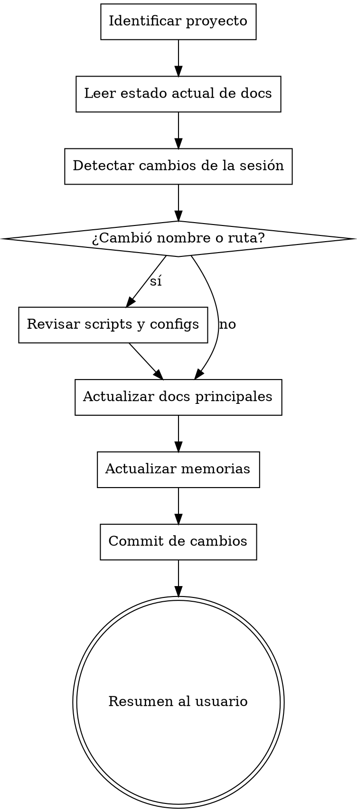

# Actualizar Proyecto

Sincroniza toda la documentación de un proyecto después de una sesión de trabajo.

## Proceso

## Paso 1: Identificar proyecto y archivos

Determinar qué proyecto se trabajó. Localizar todos los archivos relevantes:

### Siempre revisar (obligatorio)

| Archivo | Ubicación |
|---------|-----------|
| CLAUDE.md global | `~/Documents/CLAUDE/.claude/CLAUDE.md` |
| CLAUDE.md del proyecto | `~/Documents/CLAUDE/projects/{proyecto}/CLAUDE.md` |
| Memorias project_*.md | `~/.claude/projects/-Users-abgfdz93-Documents-CLAUDE/memory/project_*.md` |
| MEMORY.md índice | `~/.claude/projects/-Users-abgfdz93-Documents-CLAUDE/memory/MEMORY.md` |

### Revisar si cambió nombre, ruta o configuración

| Archivo | Qué buscar |
|---------|------------|
| Archivos `.command` | Rutas hardcodeadas, nombres de proyecto, paths a scripts |
| Scripts `.sh` | Variables HOME, rutas de logs, paths a directorios |
| Scripts `.py` | Imports, rutas de output, configuración hardcodeada |
| LaunchAgents `.plist` | ProgramArguments con rutas a scripts, WorkingDirectory |
| Otros configs | Cualquier archivo con rutas absolutas al proyecto |

**Cómo encontrarlos:** Buscar con grep en el directorio del proyecto por la ruta vieja o nombre viejo. También revisar `~/Library/LaunchAgents/` por plist relacionados.

### Revisar si el usuario dio feedback

| Archivo | Cuándo |
|---------|--------|
| Memorias feedback_*.md | Si el usuario corrigió el enfoque, dijo "no hagas X", o validó una decisión no obvia |

## Paso 2: Detectar qué cambió en la sesión

Revisar la conversación para identificar:
- Decisiones de diseño o arquitectura
- Cambios en nombres, rutas o estructura
- Nuevas funcionalidades diseñadas o implementadas
- Feedback del usuario (correcciones o validaciones)
- Cambios en roadmap o prioridades
- Cambios de moneda, idioma u otras configuraciones globales

## Paso 3: Actualizar cada archivo

### CLAUDE.md global
Solo si cambió algo que afecte las instrucciones generales:
- Nombre del proyecto
- Ubicación/ruta del proyecto
- Descripción general de la herramienta
- Skills o comandos nuevos

### CLAUDE.md del proyecto
Actualizar secciones relevantes:
- Nombre y descripción
- Estructura de archivos (si se agregaron/removieron)
- Convenciones de código o diseño
- Roadmap / pendientes
- Decisiones técnicas o de UX

### Scripts y configs (condicional)
Si se detectó cambio de nombre o ruta:
1. `grep -r "nombre_viejo\|ruta_vieja" ~/Documents/CLAUDE/projects/{proyecto}/`
2. `grep -r "nombre_viejo\|ruta_vieja" ~/Library/LaunchAgents/`
3. Actualizar cada ocurrencia encontrada
4. Verificar que los `.command` sigan funcionando (usan `cd "$(dirname "$0")"` = OK, rutas absolutas = revisar)

### Memorias
- **project_*.md**: Actualizar existentes o crear nuevas si hay temas no cubiertos
- **feedback_*.md**: Solo si el usuario dio feedback nuevo (corrección o validación)
- Respetar formato: frontmatter YAML + contenido + **Why:** + **How to apply:**
- NO crear duplicadas — verificar si ya existe antes de crear

### MEMORY.md índice
- Agregar entradas nuevas si se crearon memorias
- Actualizar descripciones si cambiaron significativamente
- Mantener conciso (max 200 líneas)

## Paso 4: Commit de cambios

Después de actualizar toda la documentación, hacer commit de los cambios en el proyecto.

### Proceso

1. **Verificar si el proyecto tiene Git inicializado** — ejecutar `git status` en el directorio del proyecto
   - Si NO tiene Git → **saltar este paso**, no inicializar Git sin que el usuario lo pida
   - Si SÍ tiene Git → continuar
2. **Revisar archivos modificados y sin rastrear** — `git status` + `git diff`
3. **Agregar archivos relevantes** — solo archivos del proyecto y documentación. NO agregar:
   - `.env`, credenciales, tokens
   - `venv/`, `node_modules/`, `__pycache__/`
   - Archivos grandes de multimedia (`.mp4`, `.jpg`, `.png`) a menos que sean parte esencial del proyecto
4. **Crear commit** con mensaje descriptivo en español que resuma los cambios de la sesión
   - Formato: `"actualizar [proyecto]: [resumen de cambios]"`
   - Ejemplo: `"actualizar stockwise: agregar pestaña de tendencias y fix scorecard"`
5. **NO hacer push** — solo commit local, nunca push automático

### Reglas del commit
- Si no hay cambios pendientes → saltar este paso
- Si hay conflictos o situaciones raras → preguntar al usuario antes de actuar
- Nunca usar `--force`, `--amend`, ni `--no-verify`
- Incluir Co-Authored-By de Claude en el mensaje

## Paso 5: Resumen

Mostrar al usuario:

| Archivo | Acción | Qué cambió |
|---------|--------|------------|
| CLAUDE.md global | Actualizado / Sin cambios | ... |
| CLAUDE.md del proyecto | Actualizado / Sin cambios | ... |
| project_*.md | Actualizado / Creado / Sin cambios | ... |
| feedback_*.md | Creado / Sin cambios | ... |
| MEMORY.md | Actualizado / Sin cambios | ... |
| script.sh | Actualizado / Sin cambios | ... |
| *.command | Actualizado / Sin cambios | ... |
| Git commit | Realizado / Sin cambios / Sin Git | ... |

## Reglas

- NO crear memorias duplicadas — verificar si ya existe antes de crear
- NO inventar información — solo documentar lo que se discutió/decidió en la sesión
- NO modificar memorias de tipo `user` a menos que el usuario lo pida
- Memorias `feedback` solo se crean/modifican si hubo feedback explícito del usuario
- Respetar nomenclatura: "CLAUDE.md global" = workspace, "CLAUDE.md del proyecto" = por proyecto
- Preguntar si hay ambigüedad sobre qué proyecto actualizar
- Al buscar rutas en scripts, usar grep sobre el directorio completo del proyecto — no asumir qué archivos tienen rutas
